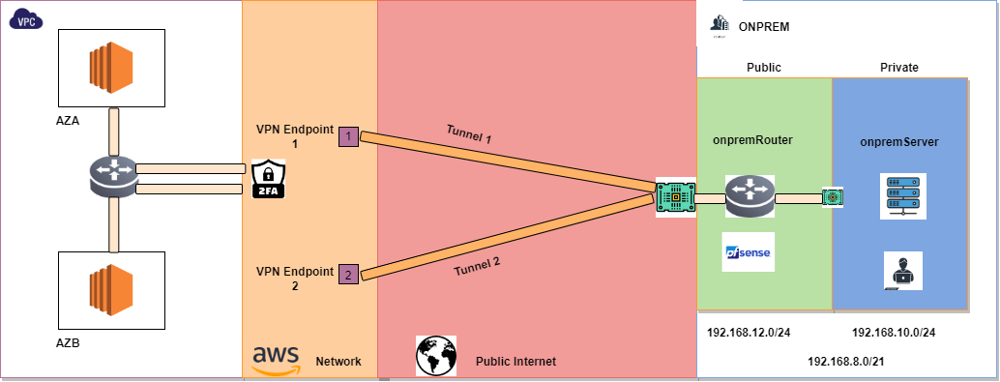

# Advanced Demo - Simple Site2Site VPN

In this mini project I implement a site to site VPN between AWS and a simulated on-premises business site running the pfSense router/NAT software.

The demo consists of 5 stages, each implementing additional components of the architecture  

- Stage 1 - Create Site2Site VPN
- Stage 2 - Configure onpremises Router  
- Stage 3 - Routing & Security
- Stage 4 - Testing
- Stage 6 - Cleanup
  
## 1-Click Install  
- Make sure you are logged into AWS and in `us-east-1`
- you will need to approve this [subscription](https://aws.amazon.com/marketplace/pp?sku=cphb99lr7icr3n9x6kc3102s5) it's a trial, so you won't be billed anything extra. 
- You will need to have an SSH keypair created in `us-east-1` and select this when using the 1-click deployment below
- Once approved, you can use the one click deployment below.
- [SimpleSite2SiteVPN](https://console.aws.amazon.com/cloudformation/home?region=us-east-1#/stacks/create/review?templateURL=https://learn-cantrill-labs.s3.amazonaws.com/aws-simple-site2site-vpn/infra.yaml&stackName=S2SVPN)  (**be sure to select a keypair**)
- Stage 1 - Create Site2Site VPN <= `YOU ARE HERE`
- Stage 2 - Configure onpremises Router
- Stage 3 - Routing & Security
- Stage 4 - Testing
- Stage 5 - Cleanup

# Get IP Address for the onpremises Router

Go to the 1-click deployment cloudformation template https://us-east-1.console.aws.amazon.com/cloudformation/home?region=us-east-1#/stacks?filteringStatus=active&filteringText=&viewNested=true&hideStacks=false  
Click `infra` stack  
Click `Outputs` tab  
Note down the Router IP, you will need is soon  

# Create customer Gateway Object

Move to the `VPC` console, under `Virtual private network (VPN)` click `Customer Gateways`  
Click `Create Customer Gateway`  
For `Name tag` enter `A4L-onpremRouter`  
For `IP address` enter the IP address you noted down above  
Click `Create customer gateway`  

# Create VGW and Attach to the AWS VPC

Move to the `VPC` console, under `Virtual private network (VPN)` click `Virtual Private Gateways`  
Click `Create virtual private gateway`  
Under `Name tag` enter `awsVGW`  
Click `Create virtual private gateway`  
Select `awsVGW`, click `Actions` and `Attach to VPC`  
Click the `Available VPCs` dropdown, select `A4L-AWS` and click `Attach to VPC`  

# Create VPN Connection

Move to the `VPC` console, under `Virtual private network (VPN)` click `Site-to-Site VPN Connections`  
Click `Create VPN connection`  
under `Name tag` enter `AWS-Site2SIteVPN`  
under `Target gateway type` select `Virtual private gateway`  
under `Virtual private gateway` click the dropdown and select `awsVGW`  
under `Customer gateway ID` click the dropdown and select `A4L-onpremRouter` 
for `Routing options` select `static`.  
for `Static IP prefixes` enter `192.168.8.0/21` (this is the IP range that the onprem network is using)  
Click `Create VPN Connection`  

# Download VPN Connection configuration file

With the `AWS-Site2SIteVPN` selected, wait for it to move into an `available` state.    
then click `Download configuration`.   
change the `vendor` to `pfsense`.   
ensure platform is set to `pfSense`  
ensure `Software` is set to `pfsense XXXX (GUI)` (2.2.5 or higher)  
ensure `IKE version` is set to `ikev1`  
click `Download`. 
You will be using the configuration file in the next stage.  

- Stage 1 - Create Site2Site VPN 
- Stage 2 - Configure onpremises Router <= `YOU ARE HERE`
- Stage 3 - Routing & Security
- Stage 4 - Testing
- Stage 5 - Cleanup

# Login to the onpremRouter

Move to the EC2 console, Click `Instances` under `Instances`  
Select `onpremRouter`, note down the `Public IPv4 address`  
right click, `monitor and troubleshoot` then `Get System Log`  
Locate `ec2-user password changed to:` and note down the password of the `router`  
Browse to https://onpremRouterPublicIPv4  
Enter the `Username` `admin`  
Enter the `Password` you just copied down  
Click `SIGN IN`  
Click the `pfSense+` logo at the top left of the screen to bypass the wizard. 
Click `Accept` on any copyright ot trademark notices (these might not show). 
Click `Close` on any informational notices (these might not show). 

# Configure Networking of pfSense router

In pfSense click `Interfaces` => `Assignments`.  
You will see WAN & ena0.  
CLick the `+ Add` next to the `available network ports`, this should change to LAN, click `Save` if shown.  
Click `Interfaces` => `LAN`.  
Check `Enable interface`.  
for `IPv4 Configuration Type` set to `DHCP`.  
click `Save`.  
Click `Apply Changes` (if shown)  

This means the pfSense router now has WAN (public) and LAN (private) interfaces.  

# VPN

For all of the steps below **make sure you have your VPN configuration file downloaded and ready, this will give you your specific values to input**. 

Click `VPN` => `IPSec'. 

# Create phase 1 tunnel to AWS AZ-1

Click `+ Add P1`.  
set `Description` to `AWS-Tunnel-AZ1`  
Ensure that `Diabled` is `unchecked`.  
Set `Key Exchange Version` to `IKEv1`.  
Set `Internet Protocol` to `IPv4`.  
set `Interface` to `WAN`.  
set `Remote Gateway` to be the IP address listed under `IPSec Tunnel #1`, `General information`, `Remote Gateway`   
ensure `Authentication Method` is set to `Mutual PSK`.  
ensure `Negotiation mode` is set to `Main`.  
ensure `My Identifier` is set to `My IP Address`.  
ensure `Peer Identifier` is set to `Peer IP Address`   
set `Pre-Shared Key` to be the key listed under `IPSec Tunnel #1`, `Phase 1 proposal (Authentication)`, `Pre-Shared Key`  

set `Encryption Algorithm` to be `AES` `128 Bits` `SHA1` `2(1024 bit)`.  
set `Life Time` to be `28800`.  

ensure `Dead Peer Detection` is `checked`.  
ensure `NAT Traversal` is `Auto`.  
ensure `Delay` is `10`.  
ensure `Max failures` is set to `3`  

Click `Save`.  

# Configure IPSEC AWS AZ-1 

Click `Show Phase 2 Entries` under the `AWS-Tunnel-AZ1`.  
Click `+ Add P2`.  
For `Description` enter `IPSEC-Tunnel1-AWS-AZ1`  
ensure `Disabled` is `unchecked`.  
ensure `Mode` is set to `Tunnel IPv4`.  
set `Local Network` type to `Network`.  
on the same line set `Address` to `192.168.10.0` and `/24`.  
set `Remote Network` type to `Network`.  
on the same line set `Address` to `10.16.0.0` and `/16`.  
Ensure `Protocol` is set to `ESP`.  
Ensure `AES` is checked and its dropdown is `128 bits`  
Ensure under `Hash Algorithms` `SHA1` is checked.  
Ensure `PFS key group` is set to `2 (1024 bit)`.   
Ensure `Life Time` is `3600`.   
for `Automatically ping host` set this to the private ip of `awsServerA` (you can get this from the EC2 console)  
Check `Enable periodic keep alive check`.   
Click `Save`.   

# Create phase 1 tunnel to AWS AZ-2

Click `+ Add P1`.  
set `Description` to `AWS-Tunnel-AZ2`  
Ensure that `Diabled` is `unchecked`.   
Set `Key Exchange Version` to `IKEv1`.   
Set `Internet Protocol` to `IPv4`.  
set `Interface` to `WAN`.  
set `Remote Gateway` to be the IP address listed under `IPSec Tunnel #2`, `General information`, `Remote Gateway`    
ensure `Authentication Method` is set to `Mutual PSK`.   
ensure `Negotiation mode` is set to `Main`.  
ensure `My Identifier` is set to `My IP Address`.   
ensure `Peer Identifier` is set to `Peer IP Address`    
set `Pre-Shared Key` to be the key listed under `IPSec Tunnel #2`, `Phase 1 proposal (Authentication)`, `Pre-Shared Key`  

set `Encryption Algorithm` to be `AES` `128 Bits` `SHA1` `2(1024 bit)`.  
set `Life Time` to be `28800`.  

ensure `Dead Peer Detection` is `checked`.   
ensure `NAT Traversal` is `Auto`.   
ensure `Delay` is `10`.   
ensure `Max failures` is set to `3`  

Click `Save`.  

# Configure IPSEC AWS AZ-2  

Click `Show Phase 2 Entries` under the `AWS-Tunnel-AZ2`.   
Click `+ Add P2`.   
For `Description` enter `IPSEC-Tunnel2-AWS-AZ2`  
ensure `Disabled` is `unchecked`.   
ensure `Mode` is set to `Tunnel IPv4`.   
set `Local Network` type to `Network`.   
on the same line set `Address` to `192.168.10.0` and `/24`.   
set `Remote Network` type to `Network`.   
on the same line set `Address` to `10.16.0.0` and `/16`.   
Ensure `Protocol` is set to `ESP`.  
Ensure `AES` is checked and its dropdown is `128 bits`  
Ensure under `Hash Algorithms` `SHA1` is checked.  
Ensure `PFS key group` is set to `2 (1024 bit)`.   
Ensure `Life Time` is `3600`.   
for `Automatically ping host` set this to the private ip of `awsServerA` (you can get this from the EC2 console)  
Check `Enable periodic keep alive check`.   
Click `Save`.   
- Stage 1 - Create Site2Site VPN 
- Stage 2 - Configure onpremises Router 
- Stage 3 - Routing & Security <= `YOU ARE HERE`
- Stage 4 - Testing
- Stage 5 - Cleanup

# AWS Side Routing

Because we're using a VGW ... we have two options, either adding routes manually or enabling route propegation so that any VGW learned routes will be added to the route table automatically - this is the option we will use for this mini project.  

Go to the `VPC` console, under `Virtual private cloud` click `Route Tables`.  
Select the `rt-aws` route table.  
Click `Routes` and notice how only the AWS VPC Local route of `10.16.0.0/16` exists.  
Click `Route Propegation`. 
Clikc `Edit Route Propegation`. 
Check `Enable` for `awsVGW`, then click `Save` 
Click `Routes` again and notice how a route for the onprem network `192.168.8.0/21` has been added via route propegation.  

# Onprem Side Routing

Because we're using a VGW ... we have two options, either adding routes manually or enabling route propegation so that any VGW learned routes will be added to the route table automatically - this is the option we will use for this mini project.  

Go to the `VPC` console, under `Virtual private cloud` click `Route Tables`.  
Select the `rt-onprem-private` route table.  
Click `Routes` then `Edit Routes`  
Click `Add Route`  
Enter `10.16.0.0/16` in the destination box.  
In the target box, select `Network Interface` then select `onpremRouter Private ENI`  
Click `Save Changes`   

# AWS Side Security Groups

Go to the `VPC` console, under `security` click `Security Groups`.  
Select the `Default A4L aws SG` security group.  
Click `Inbound Rules` and notice how there is no rule for the onpremises networks...   
Click `Edit Inbound Rules`. 
Click `Add rule`.
Adjust to `All Traffic`, Source = Custom, enter `192.168.8.0/21` and `allow onpremises In`, then click `Save Rules`. 

# On-Prem Side Security Groups

Go to the `VPC` console, under `security` click `Security Groups`.  
Select the `Default A4L onprem SG` security group.  
Click `Inbound Rules` and notice how there is no rule for the onpremises networks...   
Click `Edit Inbound Rules`. 
Click `Add rule`.
Adjust to `All Traffic`, Source = Custom, enter `10.16.0.0/16` and `allow aws In`, then click `Save Rules`. 

Go to the `VPC` console, under `security` click `Security Groups`.  
Select the `onprem Router SG` security group.  
Click `Inbound Rules`    
Click `Edit Inbound Rules`. 
Click `Add rule`.
Adjust to `All Traffic`, Source = Custom, enter `S2SVPN-onpremSG` and `allow private subnets to use VPN`, then click `Save Rules`.
- Stage 1 - Create Site2Site VPN 
- Stage 2 - Configure onpremises Router 
- Stage 3 - Routing & Security 
- Stage 4 - Testing <= `YOU ARE HERE`
- Stage 5 - Cleanup

# TESTING 

From the EC2 console, select `onpremServer`, right click, click `connect`  
Choose `RDP Client`  
Choose `Connect using Fleet Manager`  
Click `Get password`  
Click `Browse`, locate the SSH key you selected when creating the infrastructure.  
Click `Open`  then `Decrypt Password`  
Copy the `Password` into your clipboard and note it down incase you need it again.  
Click `Fleet Manager Remote Desktop` this will open a new window  
Ensure `Authentication type` is set to `User Credentials`  
Enter `Administrator` in the `Username` box  
Paste in the password you just copied into your clipboard into the `Password` box.  
Click `Connect`  
This will connect you to the onpremServer (this might take a few minutes)  
Click the `instance ID` tab toward the top  (this will give you a larger view)  
Click `Yes` to any network prompts  
This `server` is located on the onPremises network  
open `internet explorer`  
get the `Private IPv4 address` of `awsServerA` from the EC2 console.  
into the web browser on `onpremServer` type http://private_ip_of_awsServerA
if you see an internet explorer security prompt ..click `Add`, type `http://private_ip_of_awsServerA` into the box, click `Add` then `Close`  
Click `Close`  

- Stage 1 - Create Site2Site VPN 
- Stage 2 - Configure onpremises Router 
- Stage 3 - Routing & Security 
- Stage 4 - Testing 
- Stage 5 - Cleanup <= `YOU ARE HERE`

# VPN CONECTION

Go to the `VPC` console, under `Virtual Private Network (VPN)` click `Site-to-Site VPN Connections`  
Select `AWS-Site2SiteVPN`, click `Actions`, `Delete VPN Connection`   
Type `delete` and Click `Delete`  

# CUSTOMER GATEWAY

Go to the `VPC` console, under `Virtual Private Network (VPN)` click `Customer Gateways`  
Select `A4L-onpremRouter`, click `Actions`, `Delete Customer Gateway`  
Type `delete` and click `Delete`  

# VGW DETACH AND DELETE

Go to the `VPC` console, under `Virtual Private Network (VPN)` click `Virtual Private Gateways`  
Select `awsVGW`, click `Actions`, `Detach from VPC`, click `Detach virtual private gateway`  
Click `Actions`, `Delete Virtual private gateway`  
Type `delete` and click `Delete`  

# CLOUDFORMATION DELETE

Go to the cloudformation console  
Click `Stacks`  
Select the `S2SVPN` stack, click `Delete` then `Delete Stack`  

